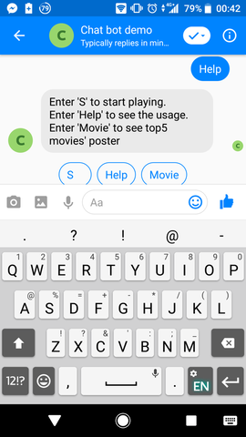
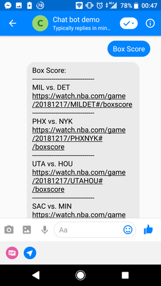
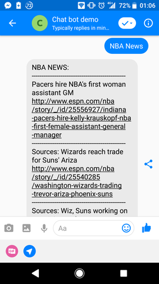

# NBA_and_Movie_Bot

This is a simple chatbot using messenger as platform and is implemented via python3. It tells nba instant information such as score, standings, points/game for each player on each team...etc, and also some movie informations.

## Getting Started
### Prerequisite
* Python 3
* Facebook Page and App
* HTTPS Server

#### Install Dependency
```
pip install -r requirements.txt
```

#### Secret Data
We must set proper `VERIFY_TOKEN` and `ACCESS_TOKEN`

### Running on Heroku
It is already deplyed on Heroku. You don't have to run it locally

<!-- ### Running locally
#### Run the server
```
python3 app.py
```
#### Run ngrok
I use `ngrok` as http server,
```
ngrok http 5000
```
and then copy the https url and paste it to your webhook verification page. -->

## Usage
Input can be either upper case or lower case. And sometimes you don't have to input exactly the "Same String" as those shown on quick-reply button or template button. I split the input sentence into words using `word_tokenize()` in nltk package. The reason I use `word_tokenize()` instead of `re.split()` is because `re.split()` doesn't achieve tokens in the linguistics sense.

The initial state is set to `user`.
* `user`
	* Input: "Help"
		* Reply: show what instructions is available from `user`

	* Input: "S"
		* Reply: go to `nbaToday`, where you can find some instant imformations

    * Input: "Movie"
        * Reply: show one of the top 15 posters that most people like on iMDB site.

And the following shows what these 3 states are capable to do:
* `help`
    show what instructions is available from `user`
    
    After that, it'll trigger `go_back()` and then advance to `user` after replying.

* `nbaToday`
    3 buttons on template as a quick guide to the next state.
    
    * Input: "NBA Games"
        * Reply: Go to `nbaGames` and shows all games today and the instant scores.
        
        And then you can choose to look deeper into boxscore, keep exploring more NBA information or go back to user.
        * Input: "Box Score"
            * Reply: go to `boxScore` and shows links to box score of every game.
            
        * Input: "More NBA"
            * Reply: go to `nbaToday`
        * Input: "Home"
            * Reply: go to `user`

    * Input: "NBA Stats"
        * Reply: Go to `nbaStats`and listen to the next step. You can then choose to see current standings of each team, or player's points-per-game on each team.
        
        * Input: "Standings"
            * Reply: Go to `nbaStandings`, and then you can choose to view standings of each team sort in conference or division.
            
            * Input: "Conference"
                * Reply: go to `confStandings` show standings of West and East conference
                
            * Input: "Division"
                * Reply: go to `divStandings` show standings of each division
                
                * ****Notice that these 2 states (`confStandings`&`divStandings`) are not communicatable.
                And then you can choose to keep exploring more NBA information or go back to user.
                * Input: "More NBA"
                    * Reply: go to `nbaToday`
                * Input: "Home"
                    * Reply: go to `user`
            
        * Input: "players Info"
            * Reply: go to `playerInfo`. Here you can choose a conference (East or West). Breaking them down to division or conference is to converge it, otherwise there's too many of them.
            
            * Input: "{conference name}"
                * Reply: go to `pickDivision`, now pick a division.
                
                * Input: "{division name}"
                    * Reply: go to `teams`, to choose a team on the division
                    
                    * Input: "{team name}"
                        * Reply: go to `playerPpg`, shows points/game of every player on that team.
                        
                        And then you can choose to keep exploring more NBA information or go back to user.
                        * Input: "More NBA"
                            * Reply: go to `nbaToday`
                        * Input: "Home"
                            * Reply: go to `user`

    * Input: "NBA news"
        * Reply: go to `nbaNews`, show you the instant news everyday written by woj!
        
        And then you can choose to keep exploring more NBA information or go back to user.
        * Input: "More NBA"
            * Reply: go to `nbaToday`
        * Input: "Home"
            * Reply: go to `user`

* `moviePics`
    * Input: "Movie"
        * Reply: go to `moviePics` and randomly shows one of the top15 poster liked by most people from iMdb.
        
        After that, it'll trigger `go_back()` and then advance to `user` after replying.

## Deployment
Add additional notes about how to deploy this on a live system

## Finite State Machine


## Authors

* **Jared Wang** - *Initial work* - (https://github.com/jens0306)


## License

This project is licensed under the MIT License
