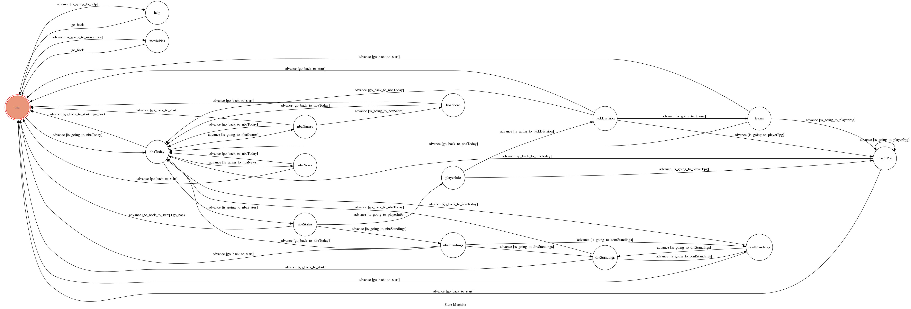

# NBA_and_Movie_Bot

This is a simple chatbot using messenger as platform and is implemented via python3. It tells nba instant information such as score, standings, points/game for each player on each team...etc, and also some movie informations.

## Getting Started
### Prerequisite
* Python 3
* Facebook Page and App
* HTTPS Server

#### Install Dependency
```
pip install -r requirements.txt
```

#### Secret Data
We must set proper `VERIFY_TOKEN` and `ACCESS_TOKEN`

### Running locally
#### Run the server
```
python3 app.py
```

#### Run ngrok
I use `ngrok` as http server,
```
ngrok http 5000
```
and then copy the https url and paste it to your webhook verification page.

### Running on Heroku
......

## Deployment
Add additional notes about how to deploy this on a live system

## Finite State Machine



## Authors

* **Jared Wang** - *Initial work* - [PurpleBooth](https://github.com/jens0306)


## License

This project is licensed under the MIT License - see the [LICENSE.md](LICENSE.md) file for details
